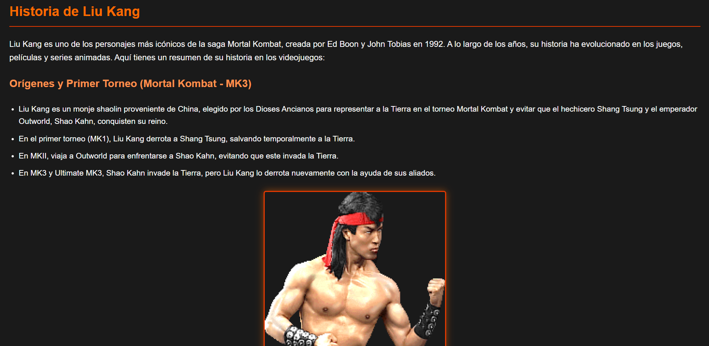
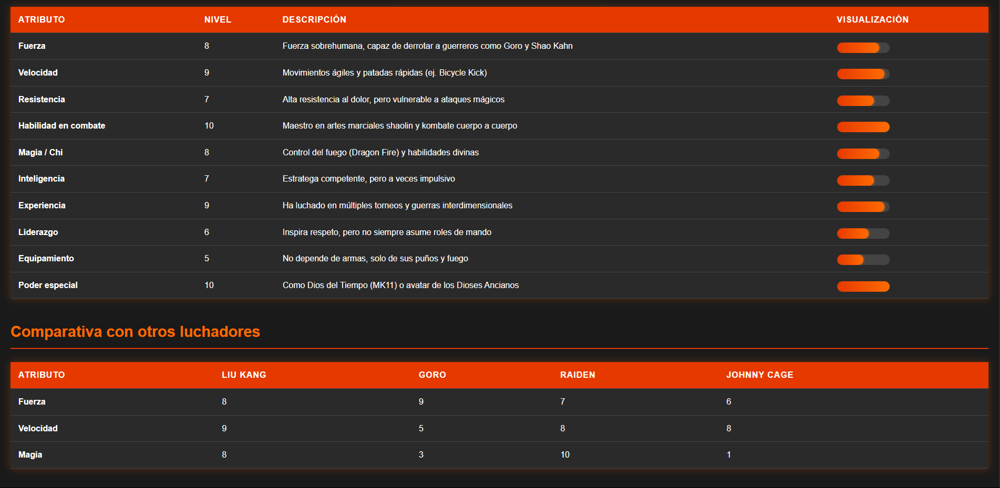
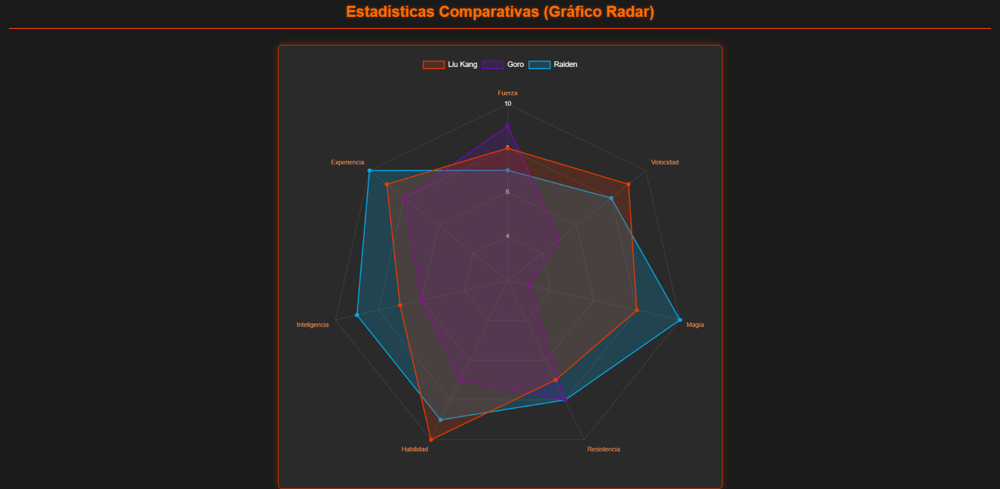

# MineriaDeDatos-Act# 🧠 Minería de Datos - Actividad HTML, CSS y JS

> 🖥️ **Tip útil:** Si estás viendo este archivo en VSCode, podés ver el formato completo del README como si fuera una página web.
>
> 📄 Presioná `Ctrl + Shift + V` o clic derecho > "Open Preview".

Este repositorio contiene una práctica desarrollada para la materia **Minería de Datos**, donde se pone en juego el uso de tecnologías web como **HTML, CSS y JavaScript**. 

El objetivo es construir una página web simple con interacción básica para demostrar conocimientos fundamentales en desarrollo front-end.

---

## 📸 Capturas de pantalla

Aquí podés ver cómo se ve el sitio:

)
)
)

---

## 🔗 Enlace a la página

Podés ver el proyecto funcionando en GitHub Pages:

👉 [Ver página en vivo](https://makkigan666.github.io/MineriaDeDatos-Act/)

---

## 🎯 Funcionalidades

- Estructura HTML semántica
- Estilos personalizados con CSS
- Comportamiento dinámico con JavaScript
- Responsividad en distintos tamaños de pantalla

---

## 📂 Estructura del proyecto

```bash
MineriaDeDatos-Act/
├── index.html
├── style.css
├── script.js
└── README.md

